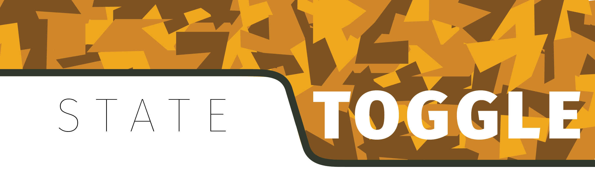
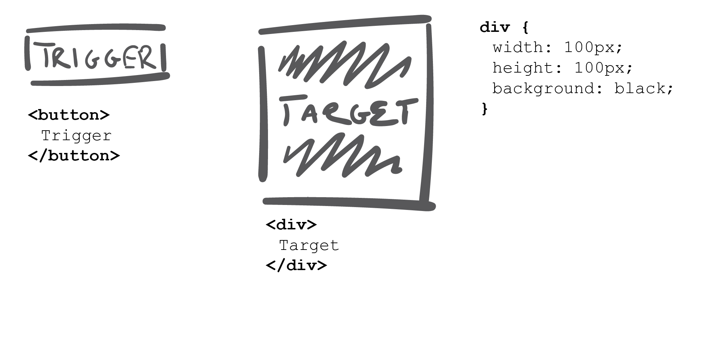
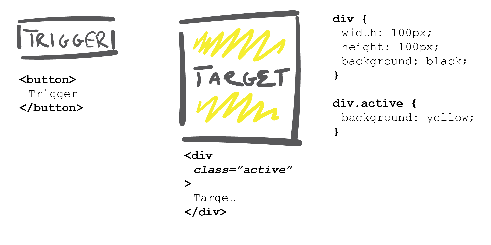
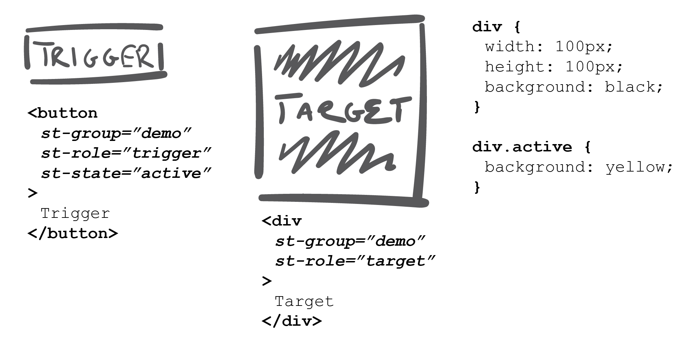

*A utility to create relationships between elements without writing any custom Javascript.*

* [Quick Start](https://github.com/BNOTIONS/state-toggle/tree/feature/docs#quick-start "Quick Start")
* [About State Toggle](https://github.com/BNOTIONS/state-toggle/tree/feature/docs#about-state-toggle "About State Toggle")
* [Quick Reference Table](https://github.com/BNOTIONS/state-toggle/tree/feature/docs#state-toggle-attributes---quick-reference-table "Quick Reference Table")
* [Detailed Reference](https://github.com/BNOTIONS/state-toggle/tree/feature/docs#state-toggle-attributes---detailed-reference "Detailed Reference")
* [Credits](https://github.com/BNOTIONS/state-toggle/tree/feature/docs#credits "Credits")
* [License](https://github.com/BNOTIONS/state-toggle/tree/feature/docs#License "License")

----
## Quick Start
Control the visual state of related Interface Elements using class-based CSS properties.

### 1. Create the HTML elements that affect each other
#### Trigger
```html
<button>Button</button>
```
#### Target
```html
<div>Target</div>
```

### 2. Create the CSS for the before and after state of the target

#### Before
```css
div {
    width: 100px;
    height: 100px;
    background: black;
}
```



#### After
```css
div.active {
   background: yellow; 
}
```


### 3. Apply State Toggle Attributes to the Elements to take care of the toggle
#### Apply st-group to the trigger and target


```html
<button st-group="demo">Button</button>
```

```html
<div st-group="demo">Target</div>
```

#### Define the roles of the trigger and target
```html
<button st-group="demo" st-role="trigger">Button</button>
```

```html
<div st-group="demo" st-role="target>Target</div>
```

#### Define the state that is being toggled on the target element
```html
<button st-group="demo" st-role="trigger" st-state="active">Button</button>
```



## About State Toggle

It is a routine situation to have an Interface that features two or more interface elements that have an effect on each other.

> *Click __this__ element, and something happens to __that__ element.*

Think: 

* lightboxes
* dropdown menus
* tooltips

In order to facilitate these common interactions, there are a number of utilities and plugins that can be used, but the interesting thing is that there is a common interaction to all of these situations:

> *When a user interacts with element __a__, something happens to element __b__*

 **State Toggle** remedies this situation by providing a single declarative solution that works for all of these scenarios without needing to write any Javascript.

All you need to do is:

* create your HTML as you normally would
* prepare your CSS for your *'before'* and *'after'* states
* implement some **State Toggle** attributes 

... and let the **State Toggle** tool look after the rest.

## Features

Behind the scenes, **State Toggle** handles:

* event binding of click events
* management of the state of the toggled element
* management of whether the trigger of the toggled element has been activated
* provision of hooks to control the appearance of triggers that have been activated
* scope control to be able to create multiple instances in an interface, or contain the scope of interaction for whatever reason
* ability to control the default state of a toggle group

## State Toggle Attributes - Quick Reference Table

### Required Attributes
| Attribute | Function |
| --------- | -------- |
| st-group | Declares elements are in a related group. Elements in the same group must have the same value set to this attribute. |
| st-role | Declares the role that the element plays in the interactive group. Value can be set to either __trigger__ or __target__. |
| st-state | Declares the state that should be toggled as a __class__ attribute on the *target*. This can be set to any value valid for a class | attribute. |

### Optional Attributes
| Attribute | Function |
| --------- | -------- |
| st-remove | Declares which __class__ attribute *state* should be removed from other elements in the interface when an element is triggered. This should be set to any relevant class attribute. |
| st-contain | Declares whether a State Toggle relationship has been scoped or contained (other elements not within the declared scope will not be affected). This can be set to any value (or left with no value). |
| st-ready | Declares whether or not the trigger is 'active' (if the trigger is able to toggle the target). This attribute can be set to the 'trigger' element and set to __false__ if disabled, or __true__ if enabled. |
| st-restrict | This can be applied to a trigger to declare whether the trigger is only able to toggle a target to either the 'off' or 'on' state. Valid values that this attribute can be set to are __on__ or __off__. |
| st-default | This can be set to the trigger element to declare whether the trigger should be in its __activate__ or __inactive__ state by default. Active triggers have the __class__ attribute set to __st-activated__. |

## State Toggle Attributes - Detailed Reference

### st-group

Declares elements are in a related group. Elements in the same group must have the same value set to this attribute.

### st-role

Declares the role that the element plays in the interactive group. Value can be set to either __trigger__ or __target__.

### st-state

Declares the state that should be toggled as a __class__ attribute on the *target*. This can be set to any value valid for a class attribute.

### st-remove

Declares which __class__ attribute *state* should be removed from other elements in the interface when an element is triggered. This should be set to any relevant class attribute.

### st-contain

Declares whether a State Toggle relationship has been scoped or contained (other elements not within the declared scope will not be affected). This can be set to any value (or left with no value).

### st-ready

Declares whether or not the trigger is 'active' (if the trigger is able to toggle the target). This attribute can be set to the 'trigger' element and set to __false__ if disabled, or __true__ if enabled.

### st-restrict

This can be applied to a trigger to declare whether the trigger is only able to toggle a target to either the 'off' or 'on' state. Valid values that this attribute can be set to are __on__ or __off__.

### st-default

This can be set to the trigger element to declare whether the trigger should be in its __activate__ or __inactive__ state by default. 

## Credits
The crew at [BNOTIONS](http://bnotions.com "BNOTIONS") put this together. We build a lot of Interfaces, and this tool got us all excited and has saved us boatloads of time.

This tool was born from a perfect storm of sorts:
* we are always looking faster ways to build prototypes
* we got tired of using a bunch of slightly different tools and implementations for things like lightboxes, tooltips, dropdowns, tabs, modals, etc that all fundamentally did the same thing - we were looking for one solution that could handle everything
* our product designers are not shy about getting their hands in the code, and we like to provide them with more ways to express themselves
* we do a lot of Hackathons, and we like the idea of building a tool that could excel in both a Hackathon and Production environment
* AngularJS brought some thoughts about how else we could take advantage of the declarative power of attributes on HTML elements

Big ups to Shawn Connors, Zach Forrester, Peter Organa, Azhar Khan, Andy Fang, Nick Karch, Liane Reale, Solomon Hsu, and Mark Reale for putting this together, kicking the tires, building demos, and providing insights.

If you are using this tool, we would love to hear your thoughts and feedback.

## License
__State-Toggle__ is available under the MIT License.

Please see the [LICENSE](/LICENSE "MIT License") for full details.


